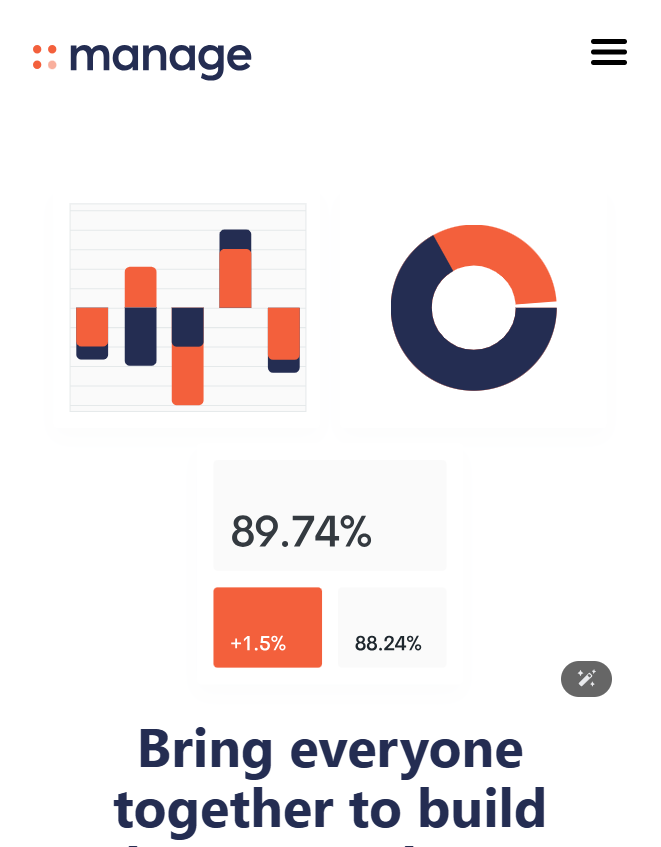

# Tailwind Manage Landing Page

This is a responsive landing page project created while following a youtube tutorial by [Brad Travery](https://www.youtube.com/watch?v=dFgzHOX84xQ&t=5309s) to practice tailwind css.

## Screenshots

### Desktop View

### Mobile View

## Features

- Fully responsive design (mobile-first)
- Tailwind CSS utility classes
- Smooth mobile navigation menu toggle
- Modern and clean landing page layout

## Tech Stack

- HTML 5
- Tailwind CSS
- JavaScript
